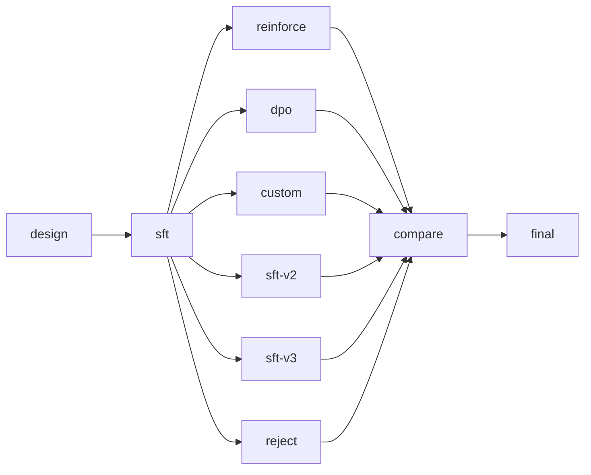
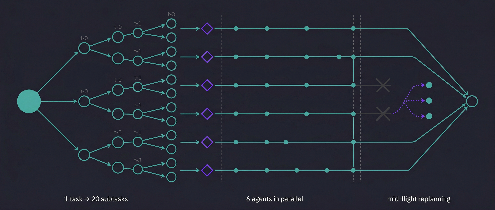
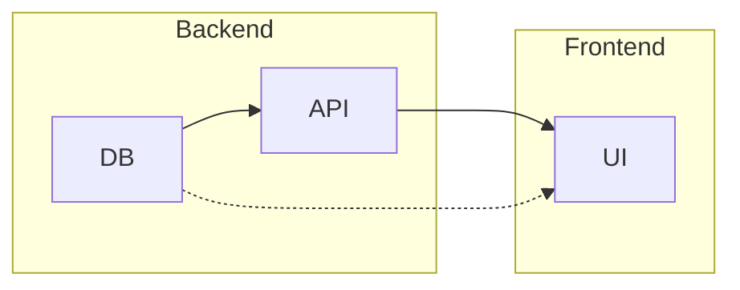

<div align="center">


# PlanDB

### **The issue tracker your AI agents are missing.**

*Think Linear or Jira — but the users are your agents, not your team.*

[](https://github.com/Agent-Field/plandb/stargazers)
[](LICENSE)
[](https://github.com/Agent-Field/plandb/commits/main)

**[Paste Into Your Agent](#paste-this-into-your-agent)** · **[Demo](#see-it-work)** · **[Architecture](docs/ARCHITECTURE.md)** · **[Examples](examples/)**

</div>

---

Your agents have no issue tracker. No dependencies. No sprints. No idea what to work on next. They start coding before the schema exists, duplicate each other's work, and forget everything between sessions.

PlanDB gives them one. Single binary, SQLite-backed, works with any agent from a prompt alone.

## Install

```bash
curl -fsSL https://github.com/Agent-Field/plandb/releases/latest/download/plandb-$(uname -s | tr '[:upper:]' '[:lower:]')-$(uname -m) -o /usr/local/bin/plandb && chmod +x /usr/local/bin/plandb
```

<details><summary>From source</summary>

```bash
cargo install --path .
```
</details>

## Paste This Into Your Agent

Copy into your system prompt, `CLAUDE.md`, `.cursorrules`, or MCP config. That's it:

```
You have plandb installed for task planning. Use it to decompose work and track progress.

Core loop:    plandb go → work → plandb done --next
Add tasks:    plandb add "title" --description "detailed spec" --dep t-xxx
Split:        plandb split --into "A, B, C" (independent) or "A > B > C" (chain)
Context:      plandb context "what you discovered" --kind discovery
Search:       plandb search "query" (BM25 across context + tasks)
Introspect:   plandb critical-path | plandb bottlenecks | plandb what-unlocks <id>
Status:       plandb status --detail

Record discoveries and decisions with plandb context as you work.
plandb go auto-surfaces relevant context — no need to search manually.
After each completion, reassess: plandb status --detail + plandb critical-path.
Plans are hypotheses — adapt as you learn.
When plandb list --status ready shows multiple tasks, parallelize them.
```

For richer prompts: `plandb prompt --for cli` · `--for mcp` · `--for http`

## See It Work

```bash
plandb init "auth-system"
plandb add "Design schema" --as schema --kind research \
  --description "Define user/session tables, auth flows, token format"
plandb add "Build API" --as api --kind code --dep t-schema \
  --description "Implement endpoints: register, login, refresh, logout"
plandb add "Write tests" --as tests --kind test --dep t-schema \
  --description "Integration tests for all auth endpoints"
plandb add "Deploy" --as deploy --kind shell --dep t-api --dep t-tests \
  --description "Docker build, push, deploy to staging"

plandb go            # claims "Design schema" (only task with no blockers)
plandb done --next   # completes it → "Build API" and "Write tests" both become ready
```

Two tasks ready = two agents work in parallel. Atomic claiming prevents conflicts.

## In the Wild: 6 Tasks Became 20

We gave one Claude Code instance one sentence: *"Build a GPT from scratch in Rust, then train it to do tool calling."*

No human intervention. PlanDB orchestrated the entire thing. The agent built a **3,769-line transformer** in pure Rust (zero ML frameworks), then ran **7 RL experiments**. The plan evolved from 6 → 20 tasks — splitting when work proved complex, parallelizing independent experiments, pivoting when REINFORCE collapsed:



| Method | Format Acc | Tool Acc | Composite |
|--------|-----------|----------|-----------|
| **Rejection Sampling** | **71.3%** | **70.0%** | **0.601** |
| SFT Baseline | 66.3% | 63.8% | 0.577 |
| DPO | 65.0% | 62.5% | 0.570 |
| REINFORCE | 0.0% | 0.0% | 0.090 |

Pre-trained weights included: `cd experiments/mini-gpt-rust && cargo run --release -- --demo`

> More in [`experiments/`](experiments/) — docs sites built autonomously by Codex, Claude Code, and Gemini CLI.

## What You Use vs What Your Agents Get

| You use | Your agents get | Why it matters |
|---|---|---|
| **Issues** | `plandb add --description "..."` | Work items with full specs, not just prompts |
| **Dependencies** | `--dep t-schema` | Right execution order, automatically |
| **Sprint board** | `plandb status --detail` | See what's blocked, ready, running, done |
| **Assignment** | `plandb go` | Atomic claiming — no two agents grab the same work |
| **Sub-issues** | `plandb split --into "A, B, C"` | Recursive decomposition to any depth |
| **Comments** | `plandb context --kind discovery` | Knowledge persists across sessions and agents |
| **Triage** | `plandb critical-path` | Prioritize the bottleneck, not just the next task |
| **Search** | `plandb search "query"` | BM25 across everything the project has learned |
| **Quality gates** | `--pre "..." --post "..."` | Conditions agents see on claim and completion |
| **Retrospective** | Context auto-surfaces via `plandb go` | Agent B gets what Agent A discovered — automatically |

## Why This Matters

Intelligence used to be the bottleneck. Now it's an API call. When reasoning becomes cheap and abundant, the constraint shifts from *thinking* to *coordinating* — and the tools built for humans coordinating at human scale don't work for agents operating at machine scale.

Agents parallelize across dozens of branches simultaneously. They decompose a task into subtasks mid-flight when it turns out harder than expected. They pivot entire subtrees when an approach fails. They work across sessions, days apart, inheriting what previous agents discovered. This isn't how humans work — it's a fundamentally different operating model that needs fundamentally different infrastructure.

<div align="center">

</div>

<br/>

**The graph IS the coordinator.** Dependencies determine execution order, parallelization, and critical path — no orchestrator agent needed. The data structure replaces the meta-agent.

**Plans are hypotheses.** `split` when harder than expected. `insert` a missed step. `pivot` when an approach fails. Dependencies rewire automatically. Adapting isn't failure — it's how planning actually works.

**Knowledge compounds across agents and sessions.** Agent A records a discovery. Three days later, Agent B claims a related task and gets it surfaced automatically via BM25. Nobody searched for it.

## Under the Hood

PlanDB uses a **compound graph** — two orthogonal structures composed:

- **Containment** (hierarchy): tasks contain subtasks, recursively, to any depth
- **Dependencies** (flow): edges between tasks at ANY level, crossing containment boundaries



A backend subtask can depend on a frontend task directly. Composites auto-complete when children finish. `plandb use t-backend` zooms into a subtree for scoped work.

## Interfaces

| | Command | For |
|---|---|---|
| **CLI** | `plandb <command>` | Claude Code, Codex, Gemini, any shell agent |
| **MCP** | `plandb mcp` | Claude Code, Cursor, Windsurf |
| **HTTP** | `plandb serve --port 8484` | Custom agents, webhooks, dashboards |

## Part of AgentField

PlanDB is the task planning layer for [**AgentField**](https://github.com/Agent-Field/agentfield) — the open-source AI backend for building and running AI agents. [**SWE-AF**](https://github.com/Agent-Field/SWE-AF) uses PlanDB internally to orchestrate parallel agent workstreams.

**[Architecture Docs](docs/ARCHITECTURE.md)** · **[Examples](examples/)** · **[CLI Reference: `plandb --help`](#)**

## License

Apache License 2.0
