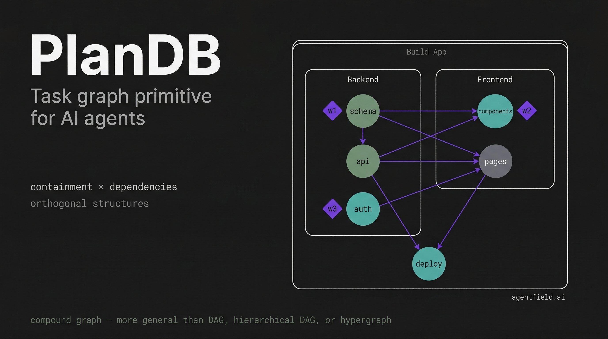
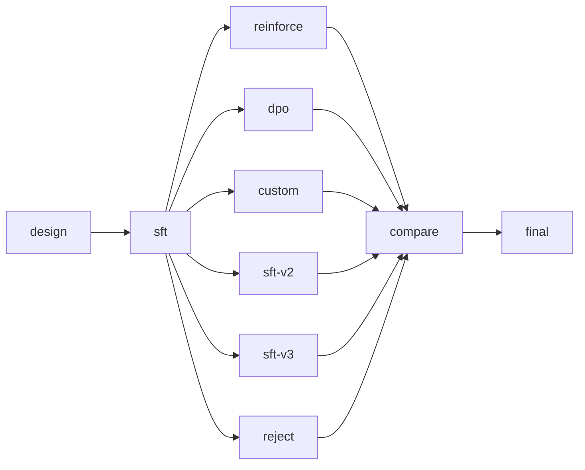
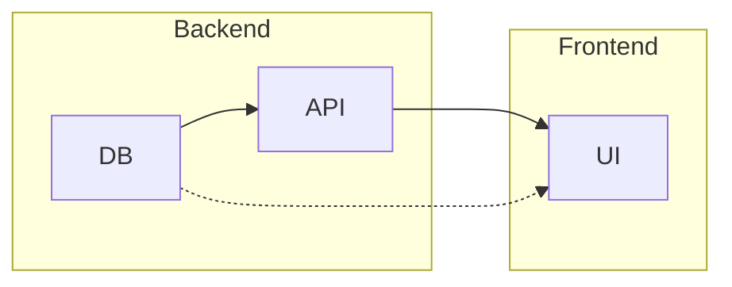

<div align="center">



# PlanDB

### **The issue tracker your AI agents are missing.**

Linear and Jira were built for humans planning at human speed. Your agents decompose tasks mid-flight, parallelize across branches, and pivot entire subtrees when an approach fails — they need infrastructure that keeps up.

PlanDB is that infrastructure. Local-first, single binary, SQLite-backed. No cloud, no accounts, no setup.

[](https://github.com/Agent-Field/plandb/stargazers)
[](LICENSE)
[](https://github.com/Agent-Field/plandb/commits/main)

**[Install](#install)** · **[Demo](#see-it-work)** · **[Architecture](docs/ARCHITECTURE.md)** · **[Examples](examples/)**

</div>

---

Your agents have no issue tracker. No dependencies. No sprints. No idea what to work on next. They start coding before the schema exists, duplicate each other's work, and forget everything between sessions.

PlanDB gives them one — like giving every agent their own Linear workspace, except it's a single binary that runs anywhere.

## Install

One command. Your agents start using it immediately — no config, no copy-paste, no prompt engineering.

```bash
curl -fsSL https://raw.githubusercontent.com/Agent-Field/plandb/main/install.sh | bash
```

The installer downloads the binary **and** auto-configures your agents with full planning instructions. Supports Claude Code, Cursor, Codex, Gemini CLI, OpenCode, Windsurf, and Aider. Re-run anytime to update — it's idempotent.

<details><summary>More install options</summary>

```bash
curl -fsSL .../install.sh | bash -s -- --all           # Silent: configure all detected frameworks
curl -fsSL .../install.sh | bash -s -- --binary-only   # Just the binary, no framework config

# From source
cargo install --path .

# Custom prompts for other frameworks
plandb prompt --for cli    # Shell agents (Codex, Aider)
plandb prompt --for mcp    # MCP agents (Claude Code, Cursor, Windsurf)
plandb prompt --for http   # HTTP agents (custom, webhooks)
```

</details>

### What Gets Installed

| Framework | What's configured | How it works |
|---|---|---|
| **Claude Code** | Rules file (`~/.claude/rules/plandb.md`) + Skill (`~/.claude/skills/plandb/`) | Always-on rules make agents plan automatically. The `/plandb` skill adds a structured 6-phase workflow with command gotchas and anti-patterns. |
| **Cursor** | Manual (instructions printed) | Paste into Cursor Settings → General → Rules for AI |
| **Codex** | `~/.codex/AGENTS.override.md` | Appended to agent instructions |
| **Gemini CLI** | `~/.gemini/GEMINI.md` | Appended to agent instructions |
| **Others** | Framework-specific config files | Aider, OpenCode, Windsurf — appended to their instruction files |

## Try It Now

After installing, open your AI agent and paste one of these prompts:

**Claude Code** (uses the `/plandb` skill for structured planning):
```
/plandb Build a CLI todo app in Python with add, list, complete, and delete commands.
Store todos in a local JSON file. Include tests.
```

**Any agent** (Codex, Gemini CLI, Cursor, etc.):
```
Use plandb to plan and build a CLI todo app in Python with add, list, complete,
and delete commands. Store todos in a local JSON file. Include tests.
```

Watch the terminal — the agent will decompose the task into a dependency graph, parallelize independent work, and track progress with `plandb go` / `plandb done --next` automatically.

## Why PlanDB

- **Compound graph, not a flat task list.** Most tools give you a list or a tree. PlanDB is a compound graph — tasks contain subtasks to any depth (like folders), and dependencies connect tasks *across* those boundaries (like symlinks). Your "Build API" subtask inside Backend can directly depend on "Define Schema" inside Database. One `split` turns a stuck task into three parallel subtasks. One `--dep` wires them into the right execution order. That's why agents using PlanDB naturally parallelize — the graph tells them exactly what's independent.

- **Plans that adapt mid-flight.** Agents don't know the full plan upfront. PlanDB expects that. `split` a task when it turns out harder than expected. `insert` a step you missed between two existing tasks — dependencies rewire automatically. `pivot` an entire subtree when an approach fails. The plan is a living hypothesis, not a static spec.

- **Knowledge that finds you.** Record discoveries, blockers, and decisions with `plandb context` as you work. When an agent claims a related task days later, that context surfaces automatically via BM25 — no one searched for it, no one remembered to pass it along. Knowledge compounds across agents and sessions.

<details><summary><strong>Everything else</strong></summary>

- **Atomic multi-agent claiming.** `plandb go` uses atomic operations — two agents cannot claim the same task. No locks, no races, no duplicate work.
- **Critical path analysis.** `plandb critical-path` shows the longest dependency chain. `plandb bottlenecks` shows what blocks the most downstream work. Focus where it matters.
- **Pre/post conditions.** `--pre "schema must exist"` and `--post "all tests pass"` attach conditions agents see when claiming and completing tasks.
- **BM25 search across everything.** Tasks, descriptions, context entries, notes — all searchable with `plandb search`.
- **Zero infrastructure.** Single binary. SQLite. No Docker, no cloud, no config files. Works offline.
- **Three interfaces.** CLI for shell agents. MCP server for Claude Code / Cursor / Windsurf. HTTP API for custom agents and dashboards.
- **Export/import patterns.** Save a decomposition as YAML, reuse it across projects. `plandb export` / `plandb import`.
- **Live terminal dashboard.** `plandb watch` for a real-time view that refreshes as tasks complete.

</details>

## See It Work

```bash
plandb init "auth-system"
plandb add "Design schema" --as schema --kind research \
  --description "Define user/session tables, auth flows, token format"
plandb add "Build API" --as api --kind code --dep t-schema \
  --description "Implement endpoints: register, login, refresh, logout"
plandb add "Write tests" --as tests --kind test --dep t-schema \
  --description "Integration tests for all auth endpoints"
plandb add "Deploy" --as deploy --kind shell --dep t-api --dep t-tests \
  --description "Docker build, push, deploy to staging"

plandb go            # claims "Design schema" (only task with no blockers)
plandb done --next   # completes it → "Build API" and "Write tests" both become ready
```

Two tasks ready = two agents work in parallel. Atomic claiming prevents conflicts.

## In the Wild: 6 Tasks Became 20

We gave one Claude Code instance one sentence: *"Build a GPT from scratch in Rust, then train it to do tool calling."*

No human intervention. PlanDB planned the entire thing. The agent built a **3,769-line transformer** in pure Rust (zero ML frameworks), then ran **7 RL experiments**. The plan evolved from 6 to 20 tasks — splitting when work proved complex, parallelizing independent experiments, pivoting when REINFORCE collapsed:



| Method | Format Acc | Tool Acc | Composite |
|--------|-----------|----------|-----------|
| **Rejection Sampling** | **71.3%** | **70.0%** | **0.601** |
| SFT Baseline | 66.3% | 63.8% | 0.577 |
| DPO | 65.0% | 62.5% | 0.570 |
| REINFORCE | 0.0% | 0.0% | 0.090 |

Pre-trained weights included: `cd experiments/mini-gpt-rust && cargo run --release -- --demo`

> More in [`experiments/`](experiments/) — docs sites built autonomously by Codex, Claude Code, and Gemini CLI.

## Under the Hood

PlanDB uses a **compound graph** — two orthogonal structures composed:

- **Containment** (hierarchy): tasks contain subtasks, recursively, to any depth
- **Dependencies** (flow): edges between tasks at ANY level, crossing containment boundaries



A backend subtask can depend on a frontend task directly. Composites auto-complete when children finish. `plandb use t-backend` zooms into a subtree for scoped work.

<details><summary><strong>What your agents get vs what you use</strong></summary>

| You use | Your agents get | Why it matters |
|---|---|---|
| **Issues** | `plandb add --description "..."` | Work items with full specs, not just prompts |
| **Dependencies** | `--dep t-schema` | Right execution order, automatically |
| **Sprint board** | `plandb status --detail` | See what's blocked, ready, running, done |
| **Assignment** | `plandb go` | Atomic claiming — no two agents grab the same work |
| **Sub-issues** | `plandb split --into "A, B, C"` | Recursive decomposition to any depth |
| **Comments** | `plandb context --kind discovery` | Knowledge persists across sessions and agents |
| **Triage** | `plandb critical-path` | Prioritize the bottleneck, not just the next task |
| **Search** | `plandb search "query"` | BM25 across everything the project has learned |
| **Pre/post conditions** | `--pre "..." --post "..."` | Conditions agents see on claim and completion |
| **Retrospective** | Context auto-surfaces via `plandb go` | Agent B gets what Agent A discovered — automatically |

</details>

## Interfaces

| | Command | For |
|---|---|---|
| **CLI** | `plandb <command>` | Claude Code, Codex, Gemini, any shell agent |
| **MCP** | `plandb mcp` | Claude Code, Cursor, Windsurf |
| **HTTP** | `plandb serve --port 8484` | Custom agents, webhooks, dashboards |

## Part of AgentField

PlanDB is the task planning layer for [**AgentField**](https://github.com/Agent-Field/agentfield) — the open-source AI backend for building and running AI agents. [**SWE-AF**](https://github.com/Agent-Field/SWE-AF) uses PlanDB internally to coordinate parallel agent workstreams.

**[Architecture Docs](docs/ARCHITECTURE.md)** · **[Examples](examples/)** · **[CLI Reference: `plandb --help`](#)**

## License

Apache License 2.0
