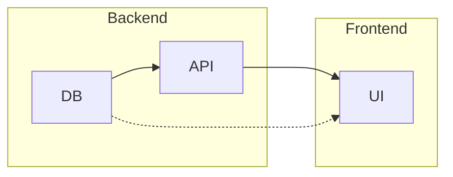
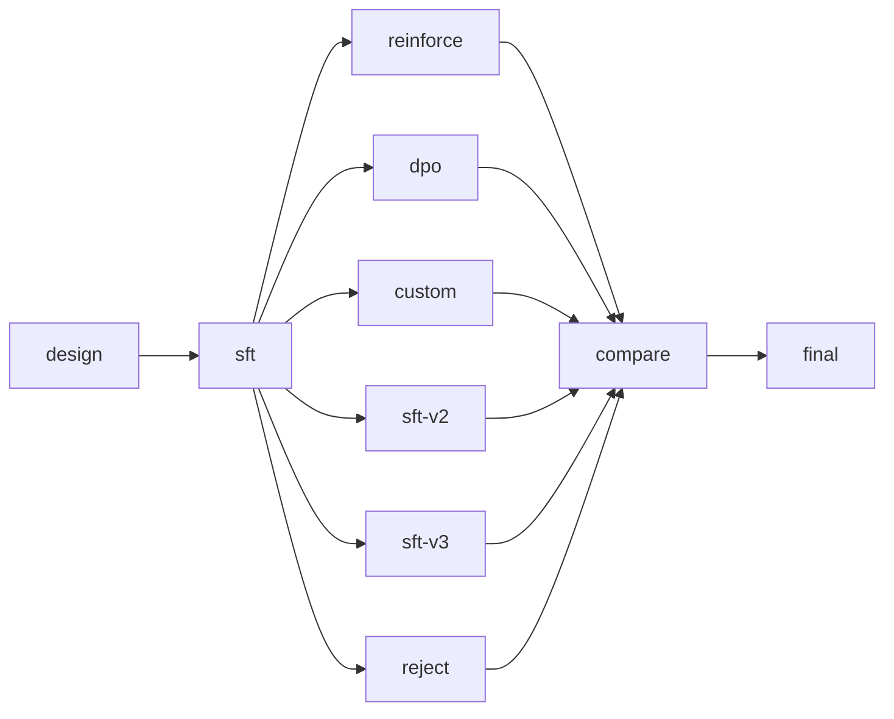

<div align="center">


# PlanDB

### **The missing primitive for agentic coordination.**

*One binary. Zero infra. Your agent gets a graph it can think with.*

[](https://github.com/Agent-Field/plandb/stargazers)
[](LICENSE)
[](https://github.com/Agent-Field/plandb/commits/main)

**[Copy-Paste Prompt](#paste-this-into-your-agent)** · **[Demo](#see-it-work)** · **[Architecture](docs/ARCHITECTURE.md)** · **[Examples](examples/)**

</div>

---

A task graph database for AI agents. Decompose, parallelize, adapt mid-flight, remember across sessions. Single binary, SQLite-backed, works with any agent from the prompt alone.

## Install

```bash
curl -fsSL https://github.com/Agent-Field/plandb/releases/latest/download/plandb-$(uname -s | tr '[:upper:]' '[:lower:]')-$(uname -m) -o /usr/local/bin/plandb && chmod +x /usr/local/bin/plandb
```

<details><summary>From source</summary>

```bash
cargo install --path .
```
</details>

## Paste This Into Your Agent

Copy into your system prompt, `CLAUDE.md`, `.cursorrules`, or MCP config. That's the entire integration:

```
You have plandb installed for task planning. Use it to decompose work and track progress.

Core loop:    plandb go → work → plandb done --next
Add tasks:    plandb add "title" --description "detailed spec" --dep t-xxx
Split:        plandb split --into "A, B, C" (independent) or "A > B > C" (chain)
Context:      plandb context "what you discovered" --kind discovery
Search:       plandb search "query" (BM25 across context + tasks)
Introspect:   plandb critical-path | plandb bottlenecks | plandb what-unlocks <id>
Status:       plandb status --detail

Record discoveries and decisions with plandb context as you work.
plandb go auto-surfaces relevant context — no need to search manually.
After each completion, reassess: plandb status --detail + plandb critical-path.
Plans are hypotheses — adapt as you learn.
When plandb list --status ready shows multiple tasks, parallelize them.
```

For richer prompts: `plandb prompt --for cli` · `--for mcp` · `--for http`

## See It Work

```bash
plandb init "auth-system"
plandb add "Design schema" --as schema --kind research \
  --description "Define user/session tables, auth flows, token format"
plandb add "Build API" --as api --kind code --dep t-schema \
  --description "Implement endpoints: register, login, refresh, logout"
plandb add "Write tests" --as tests --kind test --dep t-schema \
  --description "Integration tests for all auth endpoints"
plandb add "Deploy" --as deploy --kind shell --dep t-api --dep t-tests \
  --description "Docker build, push, deploy to staging"

plandb go            # claims "Design schema" (only task with no blockers)
plandb done --next   # completes it → "Build API" and "Write tests" both become ready
```

Two tasks ready = two agents can work in parallel. Atomic claiming prevents conflicts. The graph is the coordination layer.

## Why This Exists

Agents today have no working memory for plans. They operate in a single context window — no structured state, no dependency awareness, no cross-session memory. Give an agent "build an auth system" and it starts coding immediately with no idea what depends on what.

PlanDB fixes this with three ideas:

**1. Plans are graphs, not lists.** Tasks declare dependencies. The graph determines execution order, parallelization, and critical path — no coordinator agent needed.

**2. Plans evolve during execution.** `split` when a task is harder than expected. `insert` a missed step. `pivot` when an approach fails. Dependencies rewire automatically. This isn't failure — it's how real planning works.

**3. Knowledge persists in the graph.** Agent records a discovery with `plandb context`. Future agent claiming a related task gets it surfaced automatically via BM25. The graph becomes institutional memory across sessions and agents.

## The Compound Graph

Most task systems are flat DAGs. PlanDB composes two orthogonal structures:

- **Containment** (hierarchy): tasks contain subtasks, recursively, to any depth
- **Dependencies** (flow): edges between tasks at ANY level, crossing containment boundaries



A Backend subtask can depend directly on a Frontend task. Split to any depth. Composites auto-complete when children finish. `plandb use t-backend` zooms into a subtree for scoped reasoning.

## What This Unlocks

**Plans that adapt mid-flight.** Agent plans 6 tasks, discovers reality is harder, splits and inserts — graph grows to 20 tasks. Dependencies rewire. This is how planning actually works.

**Cross-session memory.** Agent A discovers "the API uses non-standard date formats." Agent B claims a frontend task three days later. `plandb go` auto-surfaces that discovery. No one searched for it.

**Multi-agent coordination without a coordinator.** The graph IS the coordinator. `ready` = safe to run. Atomic claiming = no conflicts. `critical-path` = what to prioritize. The data structure replaces the meta-agent.

**Quality gates agents can't skip.** `--pre` conditions on claim: *"schema must define all endpoints."* `--post` on completion: *"verify all routes return valid JSON."*

## Showcase: One Prompt, Zero Human Code

Prompt: *"Build a GPT from scratch in Rust, then train it to do tool calling."*

One Claude Code instance. No human intervention. PlanDB orchestrated the entire thing.

The agent built a **3,769-line transformer** in pure Rust (zero ML frameworks), then ran a **7-method RL experiment**. The task graph evolved from 6 → 20 tasks through mid-flight adaptation:



| Method | Format Acc | Tool Acc | Composite |
|--------|-----------|----------|-----------|
| **Rejection Sampling** | **71.3%** | **70.0%** | **0.601** |
| SFT Baseline | 66.3% | 63.8% | 0.577 |
| DPO | 65.0% | 62.5% | 0.570 |
| REINFORCE | 0.0% | 0.0% | 0.090 |

Pre-trained weights included: `cd experiments/mini-gpt-rust && cargo run --release -- --demo`

> More in [`experiments/`](experiments/) — docs sites built autonomously by Codex, Claude Code, and Gemini CLI.

## Interfaces

| | Command | For |
|---|---|---|
| **CLI** | `plandb <command>` | Claude Code, Codex, Gemini, any shell agent |
| **MCP** | `plandb mcp` | Claude Code, Cursor, Windsurf |
| **HTTP** | `plandb serve --port 8484` | Custom agents, webhooks, dashboards |

## Part of AgentField

PlanDB is the task planning layer for [**AgentField**](https://github.com/Agent-Field/agentfield) — the open-source AI backend for building and running AI agents. [**SWE-AF**](https://github.com/Agent-Field/SWE-AF) uses PlanDB internally to orchestrate parallel agent workstreams.

**[Architecture Docs](docs/ARCHITECTURE.md)** · **[Examples](examples/)** · **[CLI Reference: `plandb --help`](#)**

## License

Apache License 2.0
